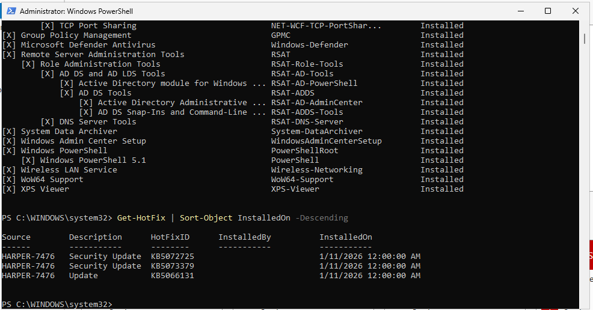
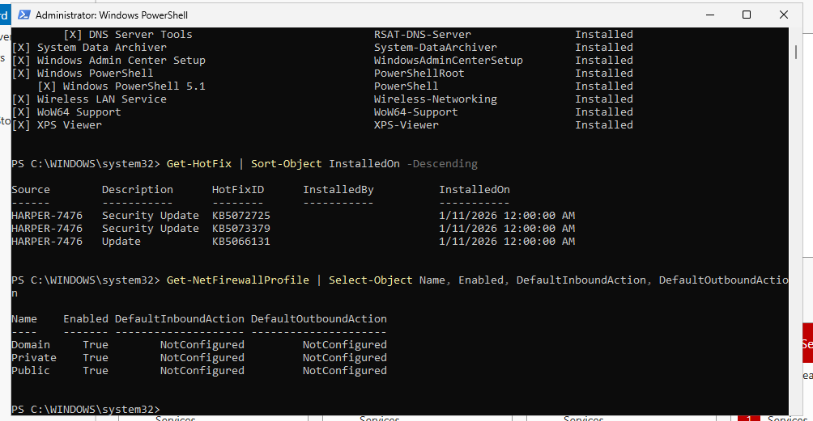
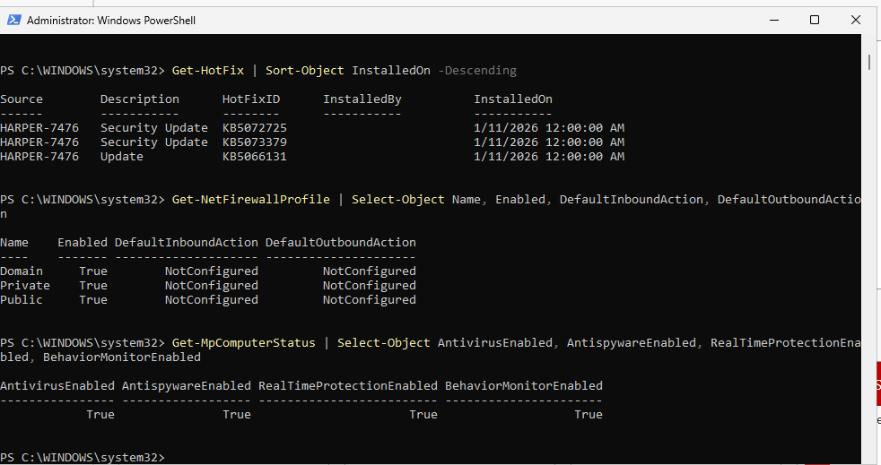
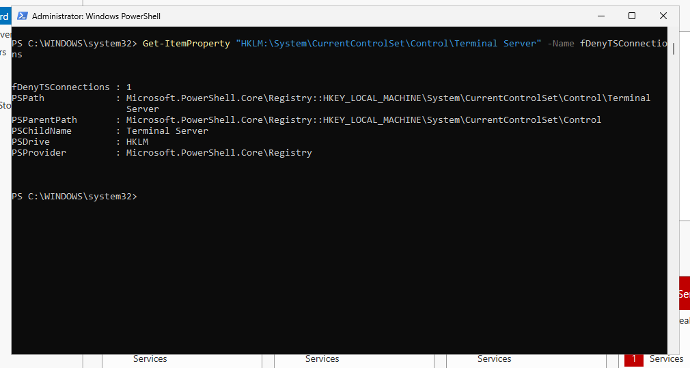
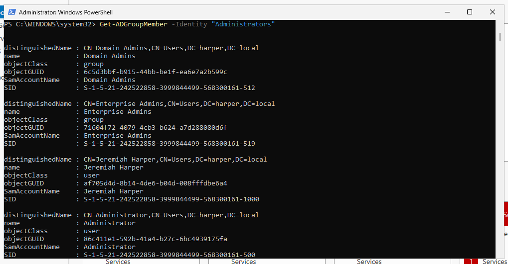
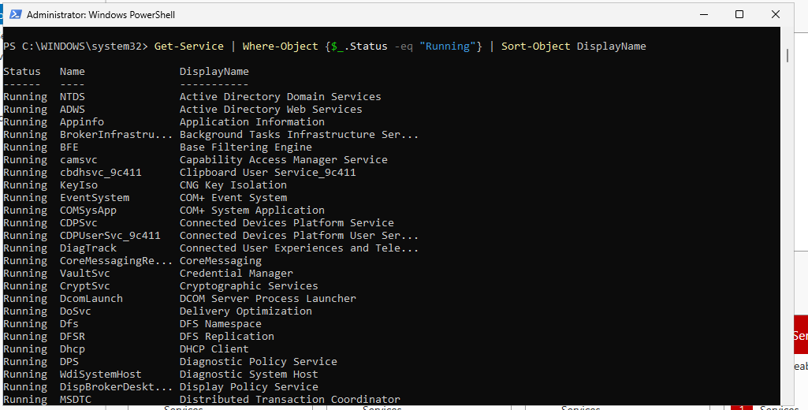
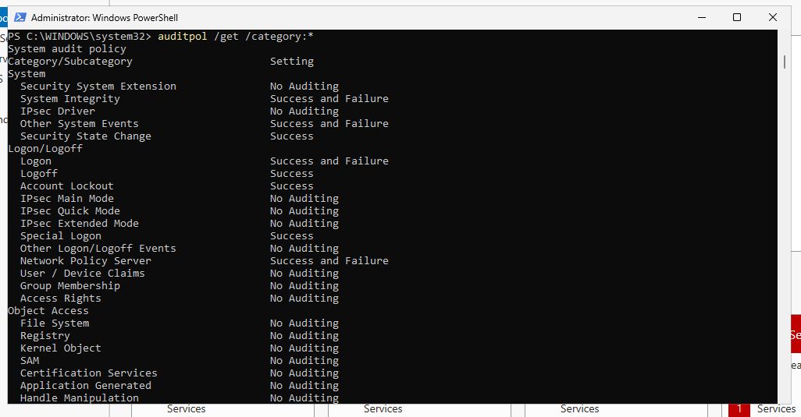
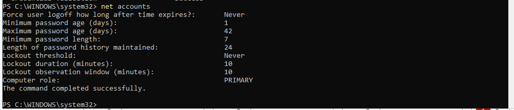

# Windows Server Security Baseline

## Purpose

Before applying security hardening configurations, the existing security state of the Windows Server 2025 Domain Controller was reviewed.

The purpose of the baseline assessment was to identify the current configuration of important Windows security controls before making changes.

This provides a reference point that can later be compared against the hardened configuration.

## Environment

| Component           | Configuration                      |
| ------------------- | ---------------------------------- |
| Operating System    | Windows Server 2025                |
| Domain              | `harper.local`                     |
| Server              | `HARPER-7476`                      |
| Server Role         | Active Directory Domain Controller |
| Directory Service   | Active Directory Domain Services   |
| Administration Tool | Windows PowerShell                 |

---

## Reviewing Installed Windows Updates

The installed Windows updates were reviewed to determine the current patch state of the server.

The following command was used:

```powershell
Get-HotFix |
Sort-Object InstalledOn -Descending
```

The results displayed previously installed Windows updates and security updates.

Reviewing installed updates establishes the server's patching baseline and helps identify whether security updates have been applied.



---

## Reviewing Windows Firewall Status

The status of the Windows Defender Firewall profiles was reviewed using:

```powershell
Get-NetFirewallProfile |
Select-Object Name, Enabled, DefaultInboundAction, DefaultOutboundAction
```

The results showed that the Domain, Private, and Public firewall profiles were enabled.

At the time of the baseline assessment, the default inbound and outbound actions were displayed as `NotConfigured`.



Additional firewall information was reviewed to better understand the effective firewall configuration:

```powershell
Get-NetFirewallProfile |
Select-Object Name,
              Enabled,
              DefaultInboundAction,
              DefaultOutboundAction,
              AllowInboundRules,
              AllowLocalFirewallRules
```

The active firewall rule set was also reviewed:

```powershell
Get-NetFirewallRule -PolicyStore ActiveStore |
Where-Object {$_.Enabled -eq "True"} |
Measure-Object
```

These commands provided additional visibility into the firewall configuration before hardening changes were considered.

---

## Reviewing Microsoft Defender

Microsoft Defender protection components were reviewed using:

```powershell
Get-MpComputerStatus |
Select-Object AntivirusEnabled,
              AntispywareEnabled,
              RealTimeProtectionEnabled,
              BehaviorMonitorEnabled
```

This command identifies whether major Microsoft Defender protection components are active.



Additional Defender preferences were reviewed using:

```powershell
Get-MpPreference |
Select-Object DisableRealtimeMonitoring,
              DisableBehaviorMonitoring,
              DisableIOAVProtection,
              DisableScriptScanning
```

This provided additional information about the protection features configured on the server.

---

## Reviewing Remote Desktop Configuration

Remote Desktop configuration was reviewed because unnecessary or insecure remote access can increase a server's attack surface.

The following registry value was checked:

```powershell
Get-ItemProperty `
"HKLM:\System\CurrentControlSet\Control\Terminal Server" `
-Name fDenyTSConnections
```

A value of `0` indicates that Remote Desktop connections are allowed, while a value of `1` indicates that Remote Desktop connections are denied.



Network Level Authentication was also reviewed:

```powershell
Get-ItemProperty `
"HKLM:\SYSTEM\CurrentControlSet\Control\Terminal Server\WinStations\RDP-Tcp" `
-Name UserAuthentication
```

The Remote Desktop Services service was checked using:

```powershell
Get-Service -Name TermService |
Select-Object Name, Status, StartType
```

These checks established the existing Remote Desktop configuration before any hardening decisions were made.

---

## Reviewing Privileged Administrative Access

Because the server functions as an Active Directory Domain Controller, privileged domain groups were reviewed instead of relying on standard local administrator groups.

The Domain Admins group was reviewed using:

```powershell
Get-ADGroupMember -Identity "Domain Admins"
```

The Enterprise Admins group was also reviewed:

```powershell
Get-ADGroupMember -Identity "Enterprise Admins"
```

The baseline review showed that the built-in `Administrator` account held privileged administrative access.



This information was documented so privileged account access could be evaluated during the hardening phase.

---

## Reviewing Running Services

Running Windows services were reviewed using:

```powershell
Get-Service |
Where-Object {$_.Status -eq "Running"} |
Sort-Object DisplayName
```

Reviewing active services helps identify unnecessary services that may increase the server's attack surface.

No services were disabled during the baseline assessment.



---

## Reviewing Windows Audit Policy

The existing Windows audit policy was reviewed using:

```powershell
auditpol /get /category:*
```

This command displays the auditing configuration for security-related activities such as logon events, account management, policy changes, privilege use, and system events.



The results were retained as a baseline before additional security auditing was configured later in the hardening process.

---

## Reviewing Password and Account Policy

The existing password and account configuration was initially reviewed using:

```powershell
net accounts
```

Additional domain-specific password policy information was retrieved using:

```powershell
Get-ADDefaultDomainPasswordPolicy |
Select-Object MinPasswordLength,
              ComplexityEnabled,
              PasswordHistoryCount,
              MaxPasswordAge,
              MinPasswordAge,
              LockoutThreshold,
              LockoutDuration,
              LockoutObservationWindow
```

The baseline domain policy included:

| Security Setting           |     Baseline |
| -------------------------- | -----------: |
| Minimum Password Length    | 7 characters |
| Password Complexity        |      Enabled |
| Password History           | 24 passwords |
| Maximum Password Age       |      42 days |
| Minimum Password Age       |        1 day |
| Account Lockout Threshold  |            0 |
| Account Lockout Duration   |   10 minutes |
| Lockout Observation Window |   10 minutes |

The most significant findings were the **7-character minimum password length** and an **account lockout threshold of 0**, meaning failed authentication attempts did not trigger account lockout.



These findings were carried forward into the hardening phase for remediation.

---

## Baseline Findings

The security baseline identified several areas that required further review or hardening:

* Domain password minimum length required strengthening.
* Account lockout protection required configuration.
* Privileged administrative access required review.
* Windows auditing could be strengthened to provide greater security visibility.
* PowerShell activity required additional logging.
* Running services required review for unnecessary functionality.
* SMB configuration required review for legacy protocol support and security settings.
* Firewall, Microsoft Defender, and Remote Desktop configurations required validation before making changes.
