# Windows Server Hardening

## Purpose

After establishing the initial security baseline, the Windows Server 2025 Domain Controller was hardened to reduce unnecessary security exposure, strengthen authentication controls, improve privileged account management, and increase security logging.

The hardening process focused on making deliberate security changes while verifying each configuration before moving to the next control.

## Environment

| Component           | Configuration                      |
| ------------------- | ---------------------------------- |
| Operating System    | Windows Server 2025                |
| Domain              | `harper.local`                     |
| Server              | `HARPER-7476`                      |
| Server Role         | Active Directory Domain Controller |
| Directory Service   | Active Directory Domain Services   |
| Administration Tool | Windows PowerShell                 |

---

## Reviewing Windows Update Configuration

Before modifying security settings, the Windows Update service and recently installed updates were reviewed.

The Windows Update service was checked using:

```powershell
Get-Service -Name wuauserv |
Select-Object Name, Status, StartType
```

The service was running with a `Manual` startup type.

Recent updates were then reviewed:

```powershell
Get-HotFix |
Sort-Object InstalledOn -Descending |
Select-Object -First 10
```

The server contained installed security updates, including `KB5072725` and `KB5073379`.

Because the Windows Update service was operational and security updates were present, the service startup configuration was not changed unnecessarily.

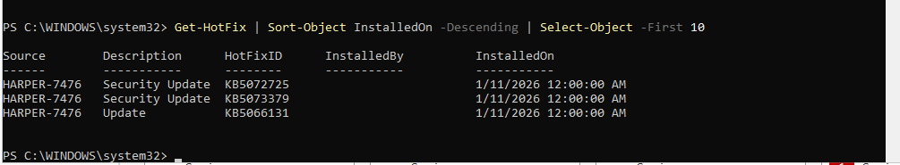

---

## Reviewing Windows Firewall Protection

Windows Defender Firewall was reviewed to verify that firewall protection was active across all network profiles.

```powershell
Get-NetFirewallProfile |
Select-Object Name, Enabled, DefaultInboundAction, DefaultOutboundAction
```

The Domain, Private, and Public profiles were all enabled.

Additional firewall information was reviewed using:

```powershell
Get-NetFirewallProfile |
Select-Object Name,
              Enabled,
              DefaultInboundAction,
              DefaultOutboundAction,
              AllowInboundRules,
              AllowLocalFirewallRules
```

The active firewall rule set was also reviewed:

```powershell
Get-NetFirewallRule -PolicyStore ActiveStore |
Where-Object {$_.Enabled -eq "True"} |
Measure-Object
```

Because this system operates as a Domain Controller, firewall rules were not blindly restricted. Active Directory depends on services such as DNS, Kerberos, LDAP, SMB, and RPC, which could be disrupted by inappropriate firewall changes.

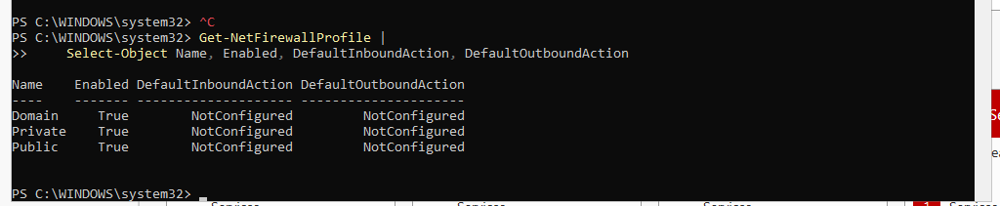

---

## Reviewing Microsoft Defender Protection

Microsoft Defender security components were reviewed to verify that endpoint protection was available on the server.

```powershell
Get-MpComputerStatus |
Select-Object AntivirusEnabled,
              AntispywareEnabled,
              RealTimeProtectionEnabled,
              BehaviorMonitorEnabled,
              IoavProtectionEnabled,
              NISEnabled
```

Defender preferences were also reviewed:

```powershell
Get-MpPreference |
Select-Object DisableRealtimeMonitoring,
              DisableBehaviorMonitoring,
              DisableIOAVProtection,
              DisableScriptScanning
```

These checks provided visibility into antivirus, real-time monitoring, behavior monitoring, downloaded-file scanning, and PowerShell script scanning protections.

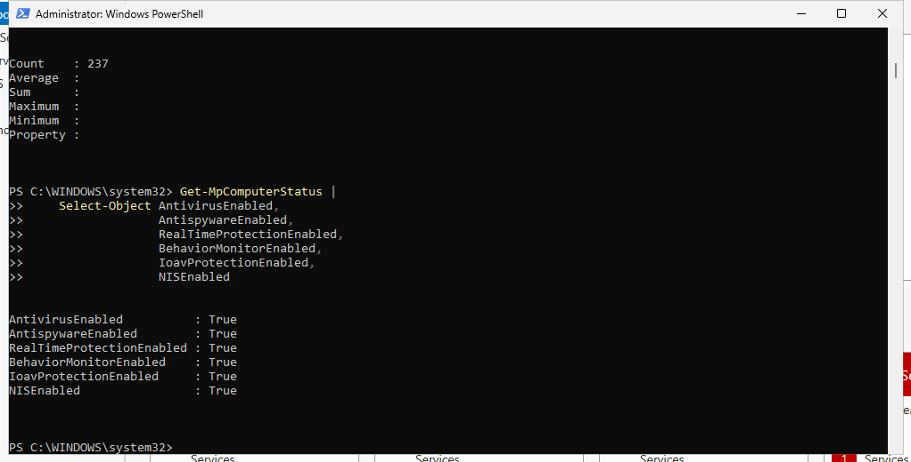

---

## Reviewing Remote Desktop Security

Remote Desktop configuration was evaluated because remote administrative access can increase the attack surface of a server if improperly configured.

The Remote Desktop connection setting was checked using:

```powershell
Get-ItemProperty `
"HKLM:\System\CurrentControlSet\Control\Terminal Server" `
-Name fDenyTSConnections
```

Network Level Authentication was reviewed using:

```powershell
Get-ItemProperty `
"HKLM:\SYSTEM\CurrentControlSet\Control\Terminal Server\WinStations\RDP-Tcp" `
-Name UserAuthentication
```

The Remote Desktop Services service was also reviewed:

```powershell
Get-Service -Name TermService |
Select-Object Name, Status, StartType
```

These checks allowed the remote-access configuration to be evaluated without unnecessarily disabling functionality required to administer the lab server.

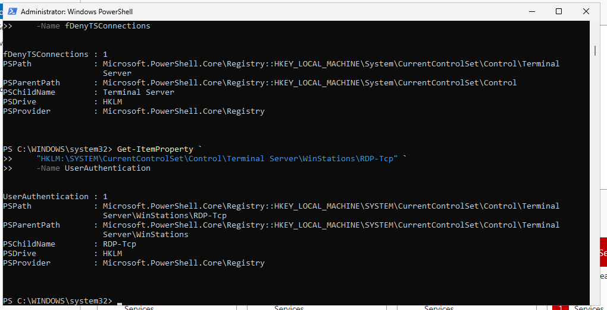

---

## Hardening the Domain Password Policy

The baseline assessment identified a minimum password length of only seven characters and an account lockout threshold of zero.

The minimum password length was increased to **14 characters**:

```powershell
Set-ADDefaultDomainPasswordPolicy `
    -Identity "harper.local" `
    -MinPasswordLength 14
```

Account lockout protection was then configured:

```powershell
Set-ADDefaultDomainPasswordPolicy `
    -Identity "harper.local" `
    -LockoutThreshold 5 `
    -LockoutDuration (New-TimeSpan -Minutes 15) `
    -LockoutObservationWindow (New-TimeSpan -Minutes 15)
```

The hardened policy was verified using:

```powershell
Get-ADDefaultDomainPasswordPolicy |
Select-Object MinPasswordLength,
              ComplexityEnabled,
              PasswordHistoryCount,
              MaxPasswordAge,
              MinPasswordAge,
              LockoutThreshold,
              LockoutDuration,
              LockoutObservationWindow
```

The resulting domain policy included:

| Security Setting          |     Before |          After |
| ------------------------- | ---------: | -------------: |
| Minimum Password Length   |          7 |         **14** |
| Password Complexity       |    Enabled |    **Enabled** |
| Password History          |         24 |         **24** |
| Maximum Password Age      |    42 days |    **42 days** |
| Minimum Password Age      |      1 day |      **1 day** |
| Account Lockout Threshold |          0 | **5 attempts** |
| Account Lockout Duration  | 10 minutes | **15 minutes** |
| Observation Window        | 10 minutes | **15 minutes** |

This strengthened authentication security while retaining the existing password complexity and password history requirements.

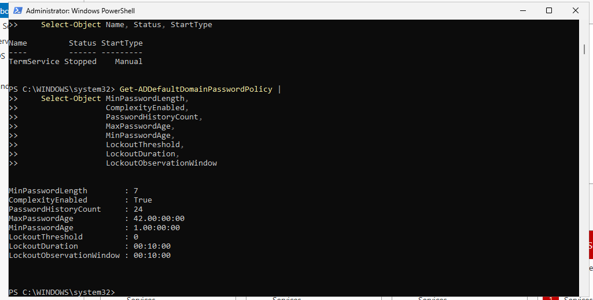

---

## Reviewing Privileged Administrative Access

Membership of highly privileged Active Directory groups was reviewed.

```powershell
Get-ADGroupMember -Identity "Domain Admins" |
Select-Object Name, SamAccountName, ObjectClass
```

Enterprise Admin membership was also reviewed:

```powershell
Get-ADGroupMember -Identity "Enterprise Admins" |
Select-Object Name, SamAccountName, ObjectClass
```

The review identified the built-in `Administrator` account as the privileged administrative account in both groups.

The account status was further reviewed:

```powershell
Get-ADGroupMember -Identity "Domain Admins" |
Where-Object {$_.ObjectClass -eq "user"} |
ForEach-Object {
    Get-ADUser $_.SamAccountName -Properties Enabled,LastLogonDate |
    Select-Object Name,SamAccountName,Enabled,LastLogonDate
}
```

The built-in Administrator account was confirmed to be enabled.

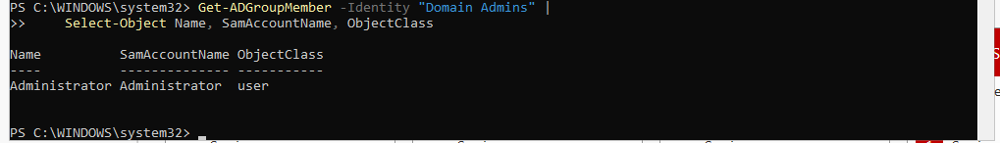

---

## Creating a Dedicated Administrative Account

A dedicated administrative account named `jeremiah.admin` was created to reduce reliance on the built-in Administrator account.

```powershell
New-ADUser `
    -Name "Jeremiah Admin" `
    -SamAccountName "jeremiah.admin" `
    -UserPrincipalName "jeremiah.admin@harper.local" `
    -Enabled $true `
    -AccountPassword (Read-Host -AsSecureString "Enter Password") `
    -PasswordNeverExpires $false
```

The account was added to the Domain Admins group:

```powershell
Add-ADGroupMember `
    -Identity "Domain Admins" `
    -Members "jeremiah.admin"
```

Membership was verified using:

```powershell
Get-ADGroupMember -Identity "Domain Admins" |
Select-Object Name, SamAccountName, ObjectClass
```

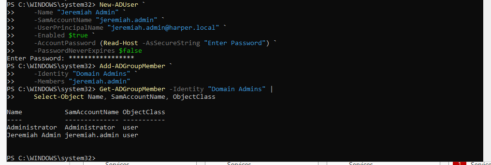

---

## Verifying Administrative Access

Before restricting the built-in Administrator account, the new administrative account was tested.

The account identity was verified using:

```powershell
whoami
```

The result confirmed the session was running as:

```text
harper\jeremiah.admin
```

Active Directory administrative access was tested using:

```powershell
Get-ADDomain
```

The command successfully returned information for the `harper.local` domain, confirming that the account could authenticate and interact with Active Directory.

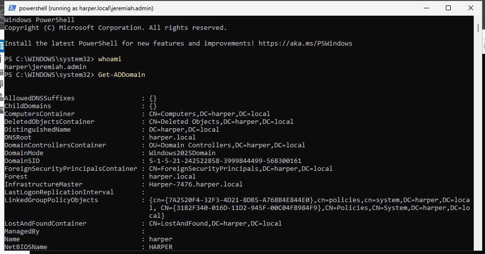

---

## Troubleshooting Administrative Privileges

During testing, an attempt to disable the built-in Administrator account initially returned:

```text
Insufficient access rights to perform the operation
```

The effective security token was investigated using:

```powershell
whoami /groups
```

The results showed `HARPER\Domain Admins` and `BUILTIN\Administrators` as:

```text
Group used for deny only
```

This indicated that the PowerShell process was authenticated using the administrative account but was not operating with an elevated administrative token.

An elevated PowerShell session was started using the dedicated administrative credentials, and the administrative group token was verified before continuing.

This troubleshooting step demonstrated the difference between **group membership** and the **effective privileges of the current Windows security token**.

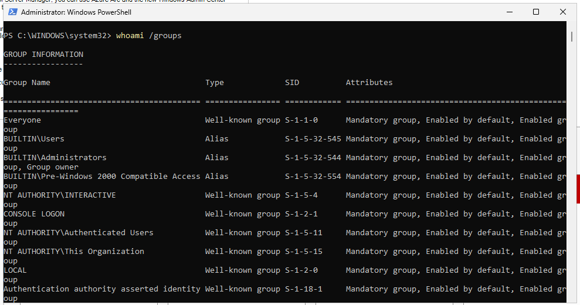

---

## Disabling the Built-in Administrator Account

After confirming that the dedicated administrative account could successfully authenticate and administer Active Directory, the built-in Administrator account was disabled.

```powershell
Disable-ADAccount -Identity "Administrator"
```

The account status was then verified:

```powershell
Get-ADUser -Identity "Administrator" -Properties Enabled |
Select-Object Name,SamAccountName,Enabled
```

The resulting configuration showed:

```text
Enabled : False
```

This reduced reliance on the default privileged account while maintaining administrative access through the verified dedicated account.

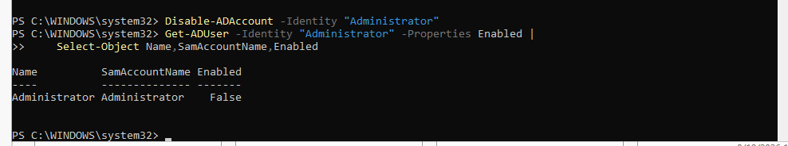

---

## Configuring Windows Security Auditing

The existing Windows audit configuration was reviewed before additional auditing was enabled:

```powershell
auditpol /get /category:*
```

Security-relevant auditing was then configured.

### Logon Auditing

```powershell
auditpol /set /subcategory:"Logon" /success:enable /failure:enable
```

### User Account Management

```powershell
auditpol /set /subcategory:"User Account Management" /success:enable /failure:enable
```

### Security Group Management

```powershell
auditpol /set /subcategory:"Security Group Management" /success:enable /failure:enable
```

### Process Creation

```powershell
auditpol /set /subcategory:"Process Creation" /success:enable
```

The resulting configuration was verified using:

```powershell
auditpol /get /subcategory:"Logon","User Account Management","Security Group Management","Process Creation"
```

These audit settings improve visibility into authentication activity, account changes, security group modifications, and process execution.


---

## Enabling PowerShell Script Block Logging

PowerShell Script Block Logging was enabled to increase visibility into PowerShell activity performed on the server.

The required registry policy location was created:

```powershell
New-Item `
    -Path "HKLM:\Software\Policies\Microsoft\Windows\PowerShell\ScriptBlockLogging" `
    -Force | Out-Null
```

Script Block Logging was then enabled:

```powershell
New-ItemProperty `
    -Path "HKLM:\Software\Policies\Microsoft\Windows\PowerShell\ScriptBlockLogging" `
    -Name "EnableScriptBlockLogging" `
    -PropertyType DWord `
    -Value 1 `
    -Force
```

The configuration was verified using:

```powershell
Get-ItemProperty `
    -Path "HKLM:\Software\Policies\Microsoft\Windows\PowerShell\ScriptBlockLogging" |
Select-Object EnableScriptBlockLogging
```

The resulting value was:

```text
EnableScriptBlockLogging : 1
```

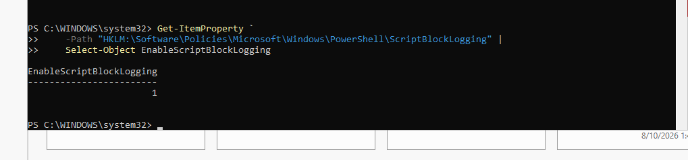

---

## Verifying PowerShell Operational Logging

PowerShell activity was generated using:

```powershell
Get-Date
```

The PowerShell Operational event log was then reviewed:

```powershell
Get-WinEvent `
    -LogName "Microsoft-Windows-PowerShell/Operational" `
    -MaxEvents 10 |
Select-Object TimeCreated, Id, LevelDisplayName, Message
```

The resulting events demonstrated that PowerShell activity was being recorded for later security monitoring and investigation.

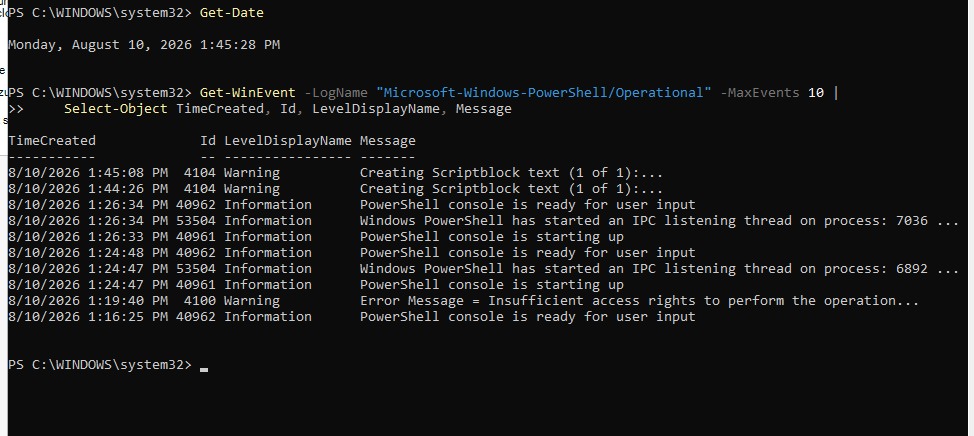

---

## Reviewing Automatically Started Services

Automatically configured Windows services were reviewed to identify potentially unnecessary functionality.

```powershell
Get-Service |
Where-Object {$_.StartType -eq "Automatic"} |
Select-Object Name, DisplayName, Status, StartType |
Sort-Object DisplayName
```

Because the server operates as an Active Directory Domain Controller, services were not disabled solely because they were running.

The review was performed to identify the server's active service footprint while avoiding changes that could interfere with Active Directory, DNS, authentication, or other required server functionality.

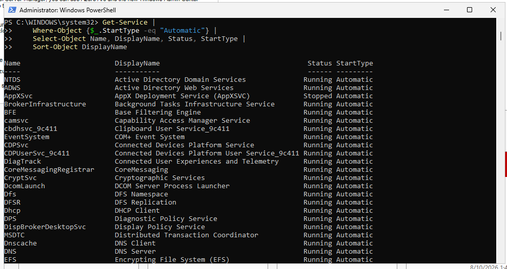

---

## Reviewing SMB Security Configuration

SMB configuration was reviewed because SMB is required for several Windows and Active Directory functions but legacy protocol support can introduce unnecessary security risk.

The following command was used:

```powershell
Get-SmbServerConfiguration |
Select-Object EnableSMB1Protocol,
              EnableSMB2Protocol,
              RequireSecuritySignature,
              EnableSecuritySignature
```

The review focused on:

* SMBv1 protocol status
* SMBv2 protocol status
* SMB signing availability
* SMB signing requirements

Because the system functions as a Domain Controller, SMB was not disabled. The configuration was reviewed to ensure that required domain functionality was considered while evaluating legacy protocol exposure.

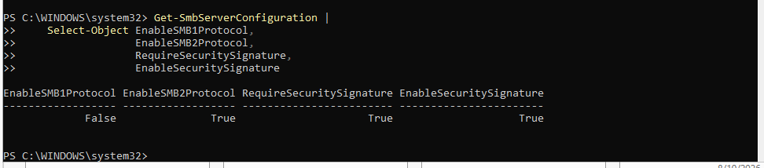

---

## Verification and Results

The Windows Server hardening process successfully strengthened several security controls while preserving the functionality required by the Active Directory Domain Controller.

Key results included:

* Increased the domain minimum password length from **7 to 14 characters**.
* Configured account lockout after **5 failed authentication attempts**.
* Increased the lockout duration and observation window to **15 minutes**.
* Reviewed highly privileged Domain Admin and Enterprise Admin membership.
* Created a dedicated administrative account for privileged administration.
* Verified the dedicated account could authenticate and administer Active Directory.
* Investigated and resolved an administrative security-token elevation issue.
* Disabled the built-in Administrator account after verifying replacement administrative access.
* Enabled auditing for logon activity, account management, security group management, and process creation.
* Enabled PowerShell Script Block Logging.
* Verified PowerShell activity through the PowerShell Operational event log.
* Reviewed automatically started services for unnecessary functionality.
* Reviewed SMB protocol and signing configuration.
* Verified Windows Firewall, Microsoft Defender, Windows Update, and Remote Desktop security configurations before making unnecessary changes.

The server remained operational as an Active Directory Domain Controller while its authentication, privileged-access, auditing, and PowerShell security controls were strengthened.
