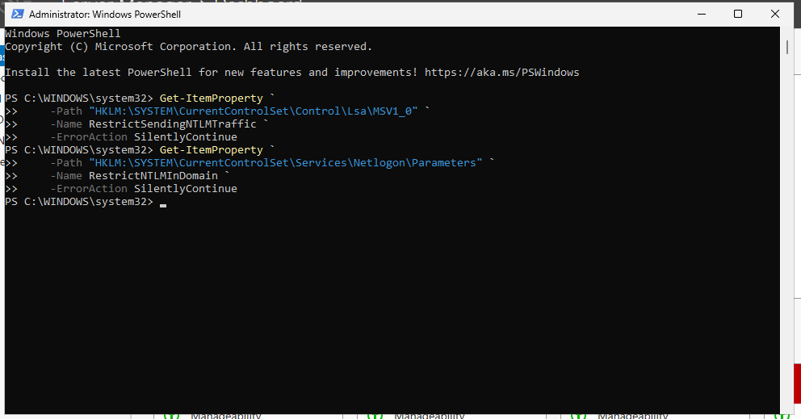
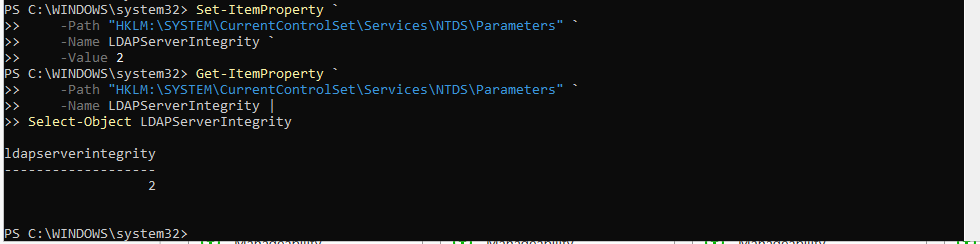
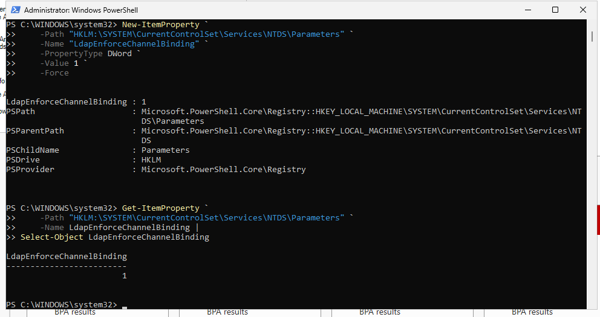
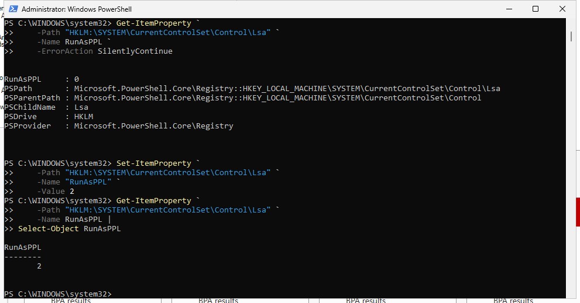
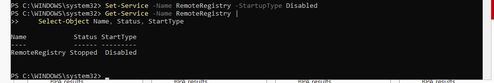
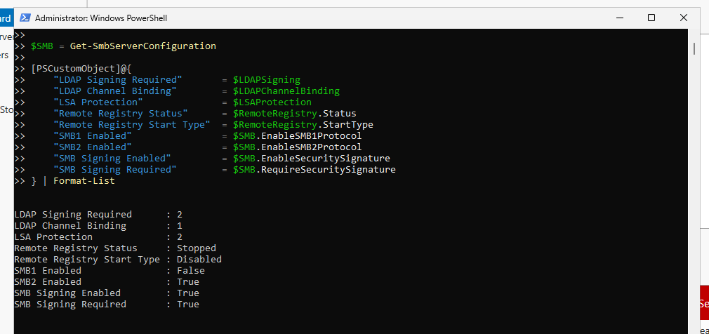

# Security Configuration

## Purpose

After completing the initial Windows Server hardening process, additional security configurations were reviewed and implemented to strengthen authentication, directory communication, credential protection, and remote attack-surface controls on the Windows Server 2025 Domain Controller.

This phase focused on security settings that directly affect Active Directory communication and privileged credential protection. Existing secure configurations were preserved when no additional changes were required.

## Environment

| Component           | Configuration                      |
| ------------------- | ---------------------------------- |
| Operating System    | Windows Server 2025                |
| Domain              | `harper.local`                     |
| Server              | `HARPER-7476`                      |
| Server Role         | Active Directory Domain Controller |
| Directory Service   | Active Directory Domain Services   |
| Administration Tool | Windows PowerShell                 |

---

## Reviewing NTLM Authentication Policy

NTLM is a legacy Microsoft authentication protocol that may still be required by older systems and applications.

Before making changes, the Domain Controller was reviewed for explicitly configured NTLM restrictions.

```powershell
Get-ItemProperty `
    -Path "HKLM:\SYSTEM\CurrentControlSet\Control\Lsa\MSV1_0" `
    -Name RestrictSendingNTLMTraffic `
    -ErrorAction SilentlyContinue
```

Domain-level NTLM restrictions were also reviewed:

```powershell
Get-ItemProperty `
    -Path "HKLM:\SYSTEM\CurrentControlSet\Services\Netlogon\Parameters" `
    -Name RestrictNTLMInDomain `
    -ErrorAction SilentlyContinue
```

LAN Manager compatibility configuration was later reviewed through both the registry and exported security policy.

```powershell
Get-ItemProperty `
    -Path "HKLM:\SYSTEM\CurrentControlSet\Control\Lsa" `
    -Name LmCompatibilityLevel `
    -ErrorAction SilentlyContinue
```

```powershell
secedit /export /cfg "$env:TEMP\SecurityPolicy.cfg" | Out-Null

Select-String `
    -Path "$env:TEMP\SecurityPolicy.cfg" `
    -Pattern "LmCompatibilityLevel"
```

No explicit `LmCompatibilityLevel` value was returned.

NTLM was not disabled or restricted solely for the purpose of creating a configuration change. In a production environment, NTLM dependencies should be audited and compatibility tested before legacy authentication is restricted.



---

## Requiring LDAP Signing

LDAP is used by systems and applications to communicate with Active Directory.

The Domain Controller's existing LDAP signing configuration was reviewed:

```powershell
Get-ItemProperty `
    -Path "HKLM:\SYSTEM\CurrentControlSet\Services\NTDS\Parameters" `
    -Name LDAPServerIntegrity `
    -ErrorAction SilentlyContinue
```

The initial configuration returned:

```text
LDAPServerIntegrity : 1
```

This indicated that LDAP signing was not required.

The setting was changed to require LDAP signing:

```powershell
Set-ItemProperty `
    -Path "HKLM:\SYSTEM\CurrentControlSet\Services\NTDS\Parameters" `
    -Name LDAPServerIntegrity `
    -Value 2
```

The resulting configuration was verified:

```powershell
Get-ItemProperty `
    -Path "HKLM:\SYSTEM\CurrentControlSet\Services\NTDS\Parameters" `
    -Name LDAPServerIntegrity |
Select-Object LDAPServerIntegrity
```

The resulting value was:

```text
LDAPServerIntegrity : 2
```

Requiring LDAP signing strengthens the integrity of LDAP communications and helps protect directory traffic against tampering and certain man-in-the-middle attacks.



---

## Reviewing SMB Security

Server Message Block provides network file and resource sharing functionality and is also used by important Active Directory resources such as `SYSVOL` and `NETLOGON`.

The SMB server configuration was reviewed:

```powershell
Get-SmbServerConfiguration |
    Select-Object EnableSMB1Protocol,
                  EnableSMB2Protocol,
                  EnableSecuritySignature,
                  RequireSecuritySignature
```

The server returned the expected secure configuration:

```text
EnableSMB1Protocol       : False
EnableSMB2Protocol       : True
EnableSecuritySignature  : True
RequireSecuritySignature : True
```

SMBv1 was already disabled, modern SMB was enabled, and SMB signing was both enabled and required.

Because the existing configuration already met the intended security requirements, no SMB configuration changes were made.

---

## Configuring LDAP Channel Binding

LDAP channel binding provides additional protection for LDAP authentication performed over TLS by binding authentication to the protected TLS connection.

The existing configuration was reviewed:

```powershell
Get-ItemProperty `
    -Path "HKLM:\SYSTEM\CurrentControlSet\Services\NTDS\Parameters" `
    -Name LdapEnforceChannelBinding `
    -ErrorAction SilentlyContinue
```

No explicit value was configured.

LDAP channel binding was configured using:

```powershell
New-ItemProperty `
    -Path "HKLM:\SYSTEM\CurrentControlSet\Services\NTDS\Parameters" `
    -Name "LdapEnforceChannelBinding" `
    -PropertyType DWord `
    -Value 1 `
    -Force
```

The configuration was verified:

```powershell
Get-ItemProperty `
    -Path "HKLM:\SYSTEM\CurrentControlSet\Services\NTDS\Parameters" `
    -Name LdapEnforceChannelBinding |
Select-Object LdapEnforceChannelBinding
```

The resulting value was:

```text
LdapEnforceChannelBinding : 1
```

This configuration enables channel-binding enforcement when supported while maintaining compatibility with clients that may not yet support stricter enforcement.



---

## Reviewing Anonymous Access Restrictions

Anonymous access restrictions were reviewed to determine whether unauthenticated enumeration could unnecessarily expose account or security information.

```powershell
Get-ItemProperty `
    -Path "HKLM:\SYSTEM\CurrentControlSet\Control\Lsa" `
    -Name RestrictAnonymous, RestrictAnonymousSAM `
    -ErrorAction SilentlyContinue |
Select-Object RestrictAnonymous, RestrictAnonymousSAM
```

The configuration was reviewed as part of the Domain Controller's security posture before proceeding with additional credential protections.

---

## Reviewing Credential Guard

Windows Defender Credential Guard was reviewed to determine whether virtualization-based credential isolation was configured.

```powershell
Get-CimInstance `
    -ClassName Win32_DeviceGuard `
    -Namespace root\Microsoft\Windows\DeviceGuard |
Select-Object SecurityServicesConfigured,
              SecurityServicesRunning,
              VirtualizationBasedSecurityStatus
```

The returned values were:

```text
SecurityServicesConfigured       : 0
SecurityServicesRunning          : 0
VirtualizationBasedSecurityStatus: 0
```

Credential Guard and virtualization-based security were therefore not active in the lab environment.

Because the Domain Controller operates inside a virtualized home-lab environment, Credential Guard was documented as an additional hardening opportunity rather than enabled without first validating hypervisor and virtualization-security requirements.

---

## Enabling LSA Protection

The Local Security Authority Subsystem Service handles sensitive Windows authentication operations and credential information.

LSA protection was reviewed using:

```powershell
Get-ItemProperty `
    -Path "HKLM:\SYSTEM\CurrentControlSet\Control\Lsa" `
    -Name RunAsPPL `
    -ErrorAction SilentlyContinue
```

The initial configuration returned:

```text
RunAsPPL : 0
```

LSA protection was enabled by configuring LSASS to run as a protected process:

```powershell
Set-ItemProperty `
    -Path "HKLM:\SYSTEM\CurrentControlSet\Control\Lsa" `
    -Name "RunAsPPL" `
    -Value 2
```

The setting was verified:

```powershell
Get-ItemProperty `
    -Path "HKLM:\SYSTEM\CurrentControlSet\Control\Lsa" `
    -Name RunAsPPL |
Select-Object RunAsPPL
```

The resulting value was:

```text
RunAsPPL : 2
```

This configuration strengthens credential protection by increasing the protection applied to the LSASS process.



---

## Reviewing WDigest Credential Storage

WDigest credential storage was reviewed because insecure legacy configurations may allow reusable logon credentials to remain accessible in LSASS memory.

```powershell
Get-ItemProperty `
    -Path "HKLM:\SYSTEM\CurrentControlSet\Control\SecurityProviders\WDigest" `
    -Name UseLogonCredential `
    -ErrorAction SilentlyContinue
```

No explicit `UseLogonCredential` value was present.

Modern Windows Server versions disable insecure WDigest credential caching by default unless explicitly overridden. Because no insecure override was identified, no configuration change was required.

---

## Reviewing LM Hash Storage

Legacy LAN Manager password hash storage was reviewed using:

```powershell
Get-ItemProperty `
    -Path "HKLM:\SYSTEM\CurrentControlSet\Control\Lsa" `
    -Name NoLMHash `
    -ErrorAction SilentlyContinue
```

The setting was reviewed to ensure legacy credential-storage behavior was not unnecessarily weakening the server's authentication security.

---

## Disabling Remote Registry

The Remote Registry service allows registry access from remote systems and can increase remote attack surface when the capability is not required.

The existing configuration was reviewed:

```powershell
Get-Service -Name RemoteRegistry |
    Select-Object Name, Status, StartType
```

The initial result showed:

```text
Name            Status   StartType
----            ------   ---------
RemoteRegistry  Stopped  Automatic
```

Although the service was stopped, its startup type was configured as `Automatic`.

Because Remote Registry was not required for administration of this lab environment, the service was disabled:

```powershell
Set-Service -Name RemoteRegistry -StartupType Disabled
```

The resulting configuration was verified:

```powershell
Get-Service -Name RemoteRegistry |
    Select-Object Name, Status, StartType
```

The service was confirmed as:

```text
RemoteRegistry  Stopped  Disabled
```

This reduced unnecessary remote-management attack surface while leaving required Domain Controller services unaffected.



---

## Reviewing Windows Remote Management

Windows Remote Management was reviewed because WinRM provides legitimate enterprise remote-management capabilities but also represents a remote administrative interface.

The WinRM service was checked:

```powershell
Get-Service -Name WinRM |
    Select-Object Name, Status, StartType
```

The service was:

```text
Status    : Running
StartType : Automatic
```

Configured WinRM listeners were then reviewed:

```powershell
Get-ChildItem WSMan:\localhost\Listener |
    Select-Object Keys
```

An HTTP listener was present:

```text
Transport = HTTP
Address   = *
```

WinRM was intentionally left enabled because PowerShell Remoting is a legitimate Windows administration capability.

The service was documented rather than disabled solely to demonstrate a configuration change.

---

## Final Security Configuration Verification

After completing the security configuration changes, the Domain Controller was restarted so restart-dependent settings could be applied.

The major security controls were then verified together.

```powershell
$LDAPSigning = (Get-ItemProperty `
    "HKLM:\SYSTEM\CurrentControlSet\Services\NTDS\Parameters").LDAPServerIntegrity

$LDAPChannelBinding = (Get-ItemProperty `
    "HKLM:\SYSTEM\CurrentControlSet\Services\NTDS\Parameters").LdapEnforceChannelBinding

$LSAProtection = (Get-ItemProperty `
    "HKLM:\SYSTEM\CurrentControlSet\Control\Lsa").RunAsPPL

$RemoteRegistry = Get-Service RemoteRegistry

$SMB = Get-SmbServerConfiguration

[PSCustomObject]@{
    "LDAP Signing Required"       = $LDAPSigning
    "LDAP Channel Binding"        = $LDAPChannelBinding
    "LSA Protection"              = $LSAProtection
    "Remote Registry Status"      = $RemoteRegistry.Status
    "Remote Registry Start Type"  = $RemoteRegistry.StartType
    "SMB1 Enabled"                = $SMB.EnableSMB1Protocol
    "SMB2 Enabled"                = $SMB.EnableSMB2Protocol
    "SMB Signing Enabled"         = $SMB.EnableSecuritySignature
    "SMB Signing Required"        = $SMB.RequireSecuritySignature
} | Format-List
```

The final verification returned:

```text
LDAP Signing Required      : 2
LDAP Channel Binding       : 1
LSA Protection             : 2
Remote Registry Status     : Stopped
Remote Registry Start Type : Disabled
SMB1 Enabled               : False
SMB2 Enabled               : True
SMB Signing Enabled        : True
SMB Signing Required       : True
```



---

## Results

The additional security configuration phase successfully strengthened several areas of the Windows Server 2025 Domain Controller.

Key results included:

* Required LDAP signing on the Domain Controller.
* Configured LDAP channel binding.
* Verified SMBv1 was disabled.
* Verified SMBv2 was enabled.
* Verified SMB signing was enabled and required.
* Reviewed NTLM and LAN Manager authentication configuration without introducing potentially disruptive restrictions.
* Reviewed Credential Guard and documented virtualization-based credential protection as a future hardening opportunity.
* Enabled LSA protected-process configuration.
* Reviewed WDigest credential-storage behavior.
* Reviewed legacy LM hash protection.
* Disabled the unnecessary Remote Registry service.
* Reviewed WinRM while retaining legitimate remote-management functionality.
* Restarted the Domain Controller and verified the major security configurations remained correctly applied.

The security configuration process strengthened directory communication, credential protection, and remote attack-surface controls while preserving the functionality required by the Active Directory environment.

