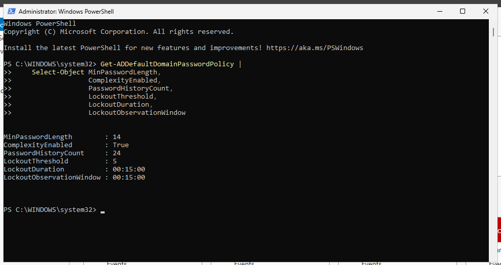
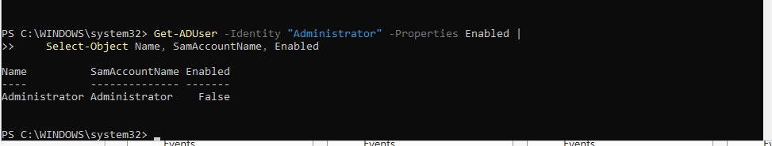
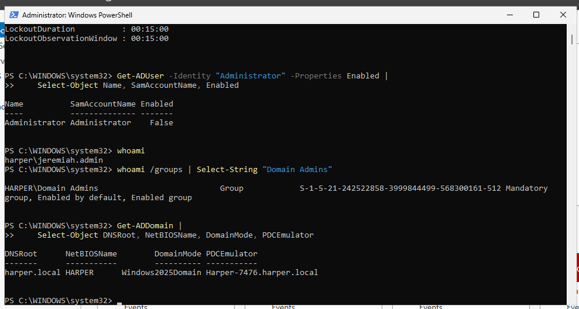
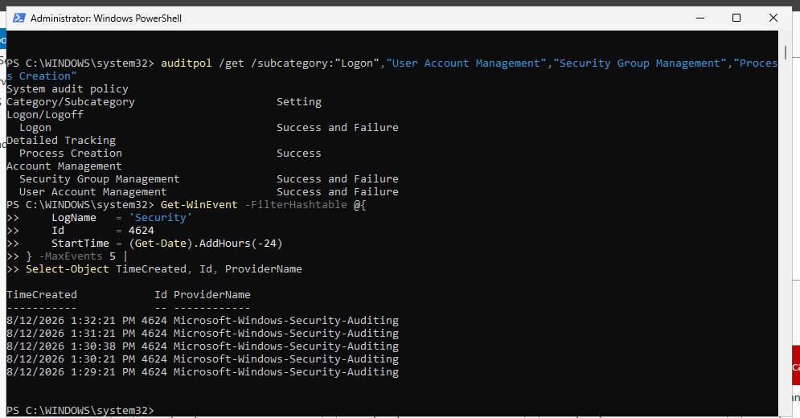
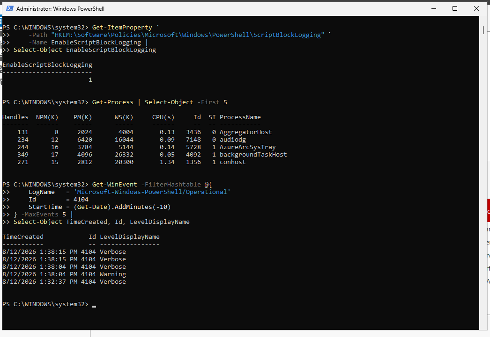
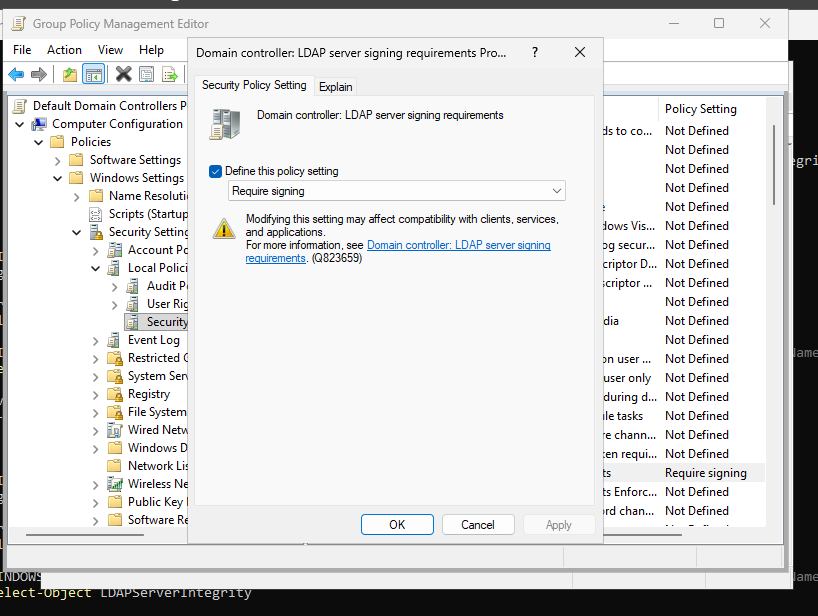
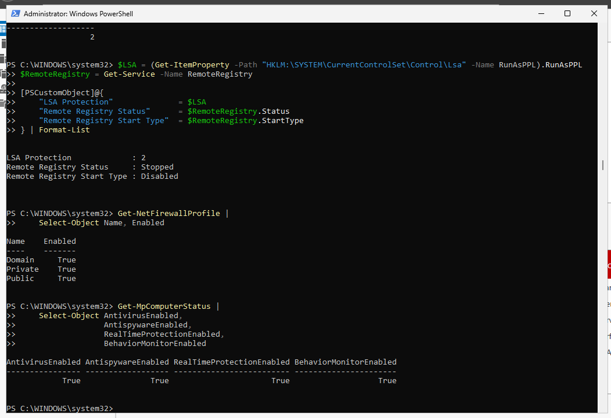
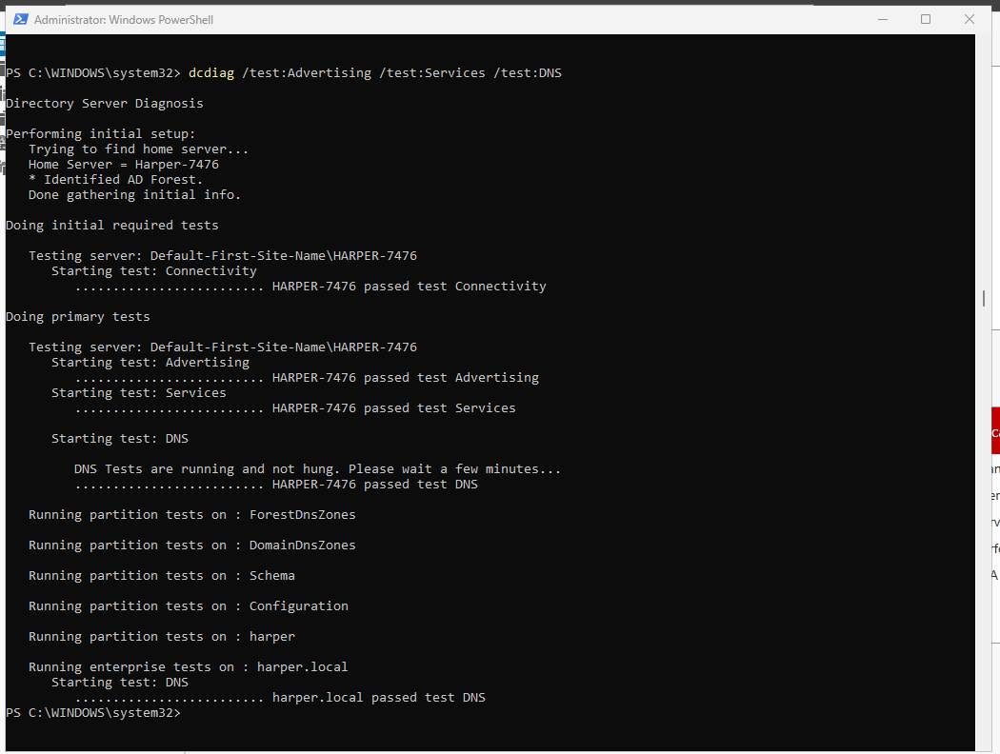
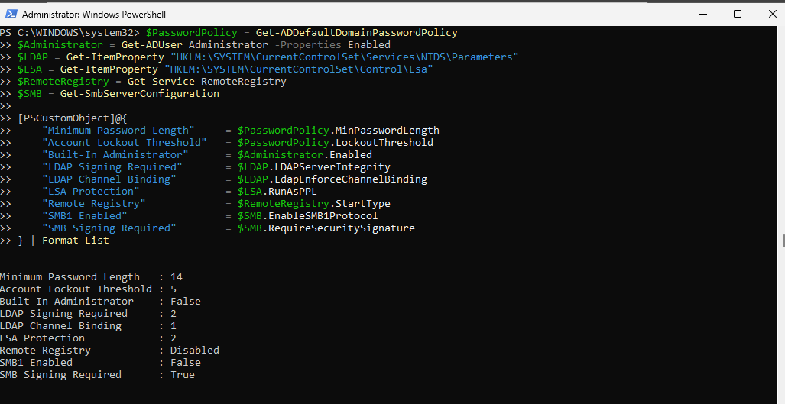

# Security Verification

## Purpose

After implementing the Windows Server hardening and security configuration changes, the environment was tested to verify that the security controls remained correctly configured and that the Active Directory Domain Controller continued to operate successfully.

The verification process focused on authentication security, privileged administrative access, security auditing, PowerShell logging, directory communication, credential protection, endpoint protection, and Domain Controller health.

Verification also identified an LDAP signing configuration that had not persisted as expected. The issue was investigated and corrected through Group Policy before final validation.

## Environment

| Component           | Configuration                      |
| ------------------- | ---------------------------------- |
| Operating System    | Windows Server 2025                |
| Domain              | `harper.local`                     |
| Server              | `HARPER-7476`                      |
| Server Role         | Active Directory Domain Controller |
| Directory Service   | Active Directory Domain Services   |
| Administration Tool | Windows PowerShell                 |

---

## Verifying Domain Password and Account Lockout Policy

The hardened Active Directory password and account lockout policy was reviewed to confirm that the settings configured during the hardening phase remained applied.

```powershell
Get-ADDefaultDomainPasswordPolicy |
    Select-Object MinPasswordLength,
                  ComplexityEnabled,
                  PasswordHistoryCount,
                  LockoutThreshold,
                  LockoutDuration,
                  LockoutObservationWindow
```

The verification confirmed:

| Security Setting           | Verified Configuration |
| -------------------------- | ---------------------: |
| Minimum Password Length    |          14 characters |
| Password Complexity        |                Enabled |
| Password History           |           24 passwords |
| Account Lockout Threshold  |             5 attempts |
| Account Lockout Duration   |             15 minutes |
| Lockout Observation Window |             15 minutes |

The hardened authentication policy remained successfully applied.



---

## Verifying the Built-In Administrator Account

The built-in Administrator account was checked to verify that it remained disabled after the dedicated administrative account was established.

```powershell
Get-ADUser -Identity "Administrator" -Properties Enabled |
    Select-Object Name, SamAccountName, Enabled
```

The account returned:

```text
Enabled : False
```

This confirmed that the default privileged Administrator account remained disabled.



---

## Verifying Dedicated Administrative Access

The dedicated administrative account was tested to ensure administrative access remained available after disabling the built-in Administrator account.

The current security identity was verified:

```powershell
whoami
```

The session returned:

```text
harper\jeremiah.admin
```

Domain Admin membership was checked:

```powershell
whoami /groups | Select-String "Domain Admins"
```

Active Directory access was then tested:

```powershell
Get-ADDomain |
    Select-Object DNSRoot, NetBIOSName, DomainMode, PDCEmulator
```

The commands successfully returned information for the `harper.local` domain.

This confirmed that the dedicated administrative account could authenticate, retain the required administrative group membership, and interact with Active Directory.



---

## Verifying Windows Security Auditing

The configured advanced audit policies were reviewed:

```powershell
auditpol /get /subcategory:"Logon","User Account Management","Security Group Management","Process Creation"
```

The verification confirmed auditing for:

| Audit Category            | Configuration       |
| ------------------------- | ------------------- |
| Logon                     | Success and Failure |
| User Account Management   | Success and Failure |
| Security Group Management | Success and Failure |
| Process Creation          | Success             |

The Windows Security event log was then queried for recent successful logon events:

```powershell
Get-WinEvent -FilterHashtable @{
    LogName   = 'Security'
    Id        = 4624
    StartTime = (Get-Date).AddHours(-24)
} -MaxEvents 5 |
Select-Object TimeCreated, Id, ProviderName
```

Event ID `4624` entries were identified, demonstrating that successful authentication activity was being recorded in the Windows Security log.

This verified both the audit configuration and actual event generation.



---

## Verifying PowerShell Script Block Logging

PowerShell Script Block Logging was verified to ensure PowerShell activity continued to generate security-relevant logging information.

The configured policy was checked:

```powershell
Get-ItemProperty `
    -Path "HKLM:\Software\Policies\Microsoft\Windows\PowerShell\ScriptBlockLogging" `
    -Name EnableScriptBlockLogging |
Select-Object EnableScriptBlockLogging
```

The resulting value confirmed:

```text
EnableScriptBlockLogging : 1
```

A PowerShell command was executed to generate activity:

```powershell
Get-Process | Select-Object -First 5
```

The PowerShell Operational log was then queried for Script Block Logging events:

```powershell
Get-WinEvent -FilterHashtable @{
    LogName   = 'Microsoft-Windows-PowerShell/Operational'
    Id        = 4104
    StartTime = (Get-Date).AddMinutes(-10)
} -MaxEvents 5 |
Select-Object TimeCreated, Id, LevelDisplayName
```

Recent Event ID `4104` entries confirmed that PowerShell Script Block Logging was actively generating events.



---

## Identifying an LDAP Signing Persistence Issue

LDAP and SMB security settings were reviewed after the Domain Controller restart.

```powershell
$NTDS = Get-ItemProperty `
    "HKLM:\SYSTEM\CurrentControlSet\Services\NTDS\Parameters"

$SMB = Get-SmbServerConfiguration

[PSCustomObject]@{
    "LDAP Signing Required" = $NTDS.LDAPServerIntegrity
    "LDAP Channel Binding"  = $NTDS.LdapEnforceChannelBinding
    "SMB1 Enabled"          = $SMB.EnableSMB1Protocol
    "SMB2 Enabled"          = $SMB.EnableSMB2Protocol
    "SMB Signing Enabled"   = $SMB.EnableSecuritySignature
    "SMB Signing Required"  = $SMB.RequireSecuritySignature
} | Format-List
```

The SMB and LDAP channel-binding settings remained correctly configured. However, LDAP signing returned:

```text
LDAP Signing Required : 1
```

The expected hardened value was:

```text
LDAP Signing Required : 2
```

This demonstrated the importance of validating security controls after configuration rather than assuming that a successful initial change guarantees persistence.

---

## Troubleshooting LDAP Signing

The LDAP signing registry configuration was checked directly:

```powershell
Get-ItemProperty -Path "HKLM:\SYSTEM\CurrentControlSet\Services\NTDS\Parameters" -Name LDAPServerIntegrity |
    Select-Object LDAPServerIntegrity
```

The value remained `1`.

Group Policy was refreshed:

```powershell
gpupdate /force
```

LDAP signing was checked again and continued to return `1`.

Because the server functions as an Active Directory Domain Controller, LDAP signing was moved from a direct registry-based configuration to Domain Controller Group Policy enforcement.

The following policy was configured:

```text
Computer Configuration
└── Policies
    └── Windows Settings
        └── Security Settings
            └── Local Policies
                └── Security Options
                    └── Domain controller: LDAP server signing requirements
```

The policy was configured as:

```text
Require signing
```

Group Policy was then refreshed:

```powershell
gpupdate /force
```

The effective LDAP signing configuration was verified again:

```powershell
Get-ItemProperty -Path "HKLM:\SYSTEM\CurrentControlSet\Services\NTDS\Parameters" -Name LDAPServerIntegrity |
    Select-Object LDAPServerIntegrity
```

The hardened value was restored:

```text
LDAPServerIntegrity : 2
```

Using Group Policy provided centralized policy enforcement appropriate for an Active Directory Domain Controller.



---

## Verifying LSA Protection and Remote Registry

Credential protection and remote attack-surface settings were reviewed after the restart and Group Policy refresh.

```powershell
$LSA = (Get-ItemProperty -Path "HKLM:\SYSTEM\CurrentControlSet\Control\Lsa" -Name RunAsPPL).RunAsPPL
$RemoteRegistry = Get-Service -Name RemoteRegistry

[PSCustomObject]@{
    "LSA Protection"             = $LSA
    "Remote Registry Status"     = $RemoteRegistry.Status
    "Remote Registry Start Type" = $RemoteRegistry.StartType
} | Format-List
```

The expected configuration remained applied:

```text
LSA Protection             : 2
Remote Registry Status     : Stopped
Remote Registry Start Type : Disabled
```

This confirmed that the credential-protection configuration persisted and that Remote Registry remained unavailable.

---

## Verifying Windows Firewall and Microsoft Defender

Core Windows host protections were reviewed to confirm they remained active.

Windows Firewall profiles were checked:

```powershell
Get-NetFirewallProfile |
    Select-Object Name, Enabled
```

The Domain, Private, and Public profiles remained enabled.

Microsoft Defender was then checked:

```powershell
Get-MpComputerStatus |
    Select-Object AntivirusEnabled,
                  AntispywareEnabled,
                  RealTimeProtectionEnabled,
                  BehaviorMonitorEnabled
```

The protection components remained enabled, confirming that endpoint security protections continued operating after the hardening process.



---

## Verifying Domain Controller Health

After completing the security changes, Active Directory health was tested to ensure the Domain Controller remained operational.

```powershell
dcdiag /test:Advertising /test:Services /test:DNS
```

The tests validated important Domain Controller functionality including:

* Active Directory service advertising
* Required Domain Controller services
* DNS functionality required by Active Directory

The tests completed successfully, demonstrating that the hardening changes did not prevent the server from performing its Domain Controller responsibilities.



---

## Final Security Verification

A final PowerShell verification was performed to summarize the major hardened controls.

```powershell
$PasswordPolicy = Get-ADDefaultDomainPasswordPolicy
$Administrator = Get-ADUser Administrator -Properties Enabled
$LDAP = Get-ItemProperty "HKLM:\SYSTEM\CurrentControlSet\Services\NTDS\Parameters"
$LSA = Get-ItemProperty "HKLM:\SYSTEM\CurrentControlSet\Control\Lsa"
$RemoteRegistry = Get-Service RemoteRegistry
$SMB = Get-SmbServerConfiguration

[PSCustomObject]@{
    "Minimum Password Length"    = $PasswordPolicy.MinPasswordLength
    "Account Lockout Threshold"  = $PasswordPolicy.LockoutThreshold
    "Built-In Administrator"     = $Administrator.Enabled
    "LDAP Signing Required"      = $LDAP.LDAPServerIntegrity
    "LDAP Channel Binding"       = $LDAP.LdapEnforceChannelBinding
    "LSA Protection"             = $LSA.RunAsPPL
    "Remote Registry"            = $RemoteRegistry.StartType
    "SMB1 Enabled"               = $SMB.EnableSMB1Protocol
    "SMB Signing Required"       = $SMB.RequireSecuritySignature
} | Format-List
```

The final hardened state was:

| Security Control               | Verified Result |
| ------------------------------ | --------------- |
| Minimum Password Length        | 14              |
| Account Lockout Threshold      | 5               |
| Built-In Administrator Enabled | False           |
| LDAP Signing Required          | 2               |
| LDAP Channel Binding           | 1               |
| LSA Protection                 | 2               |
| Remote Registry                | Disabled        |
| SMBv1 Enabled                  | False           |
| SMB Signing Required           | True            |



---

## Verification Results

The security verification process confirmed that the major hardening controls remained operational and that the Active Directory Domain Controller continued functioning successfully.

The verification demonstrated:

* Hardened password and account lockout policies remained applied.
* The built-in Administrator account remained disabled.
* The dedicated administrative account retained functional administrative access.
* Advanced Windows auditing remained enabled.
* Security log events were successfully generated.
* PowerShell Script Block Logging generated Event ID `4104`.
* SMBv1 remained disabled and SMB signing remained required.
* LDAP channel binding remained configured.
* An LDAP signing persistence issue was identified during testing and corrected through Group Policy.
* LSA protection remained configured.
* Remote Registry remained stopped and disabled.
* Windows Firewall and Microsoft Defender remained active.
* Active Directory advertising, services, and DNS functionality passed Domain Controller health testing.

The verification phase demonstrated not only that security controls could be configured, but that their effectiveness, persistence, and impact on server functionality were actively tested after implementation.
